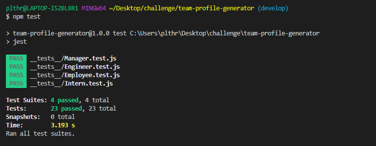
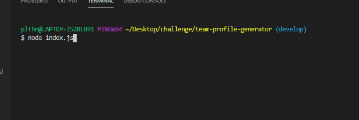

  # Team Profile Generator

  

  ## Description 
  An application which generates a webpage to help you track your team's basic information. 
  
  
  ## Motivation for development
  There are times that managers need to contact employee and having quick access to contact information will help improve efficenices. 
  
  ## Installation
  Since this is a program that is run in the command line. The following items will need to be installed on your computer to access the information:
  * You will need to have Node.js installed on your computer. 
    * You can add Node.js by going to its website at https://nodejs.org/en/ and downloading the current version. 
  * In the program itself you will need to add the inquirer package from npm. 
    * You can add npm inquirer by going to its website at https://www.npmjs.com/package/inquirer and follow the installation instructions. 
  * Jest will also need to be installed to for running tests in the test folder.
    * You can add jest by going to its website at https://jestjs.io/docs/en/getting-started.html and following the installation instructions. 
  
  
  ## Usage 
  After the files above have been installed you can run a test to make sure that the tests in the test folder all pass. This can be done by opening a new terminal and typing in the command - npm test. It should look like the following image:

  

  The next step is to use the current terminal or open a new one and enter the following command: Node index.js, in the command line. 

  Then the following command: node index.js, in the command line. 
  
  

  This will start a series of questions that when answered will auto create a webpage that contains the basic information you input.  

  
  ## Built With
  * JavaScript
  * Node.js
  * npm inquirer package
  * HTML
  
  ## License
  * MIT
  
  ## Github
  * Link to current repository: https://github.com/siwel20/team-profile-generator 

  ## Video Walkthrough
  * Screencastify link for video walkthrough: https://drive.google.com/file/d/1VIfw0p_jLqKnroQCwSh0glCNk9QuDhX7/view
  
